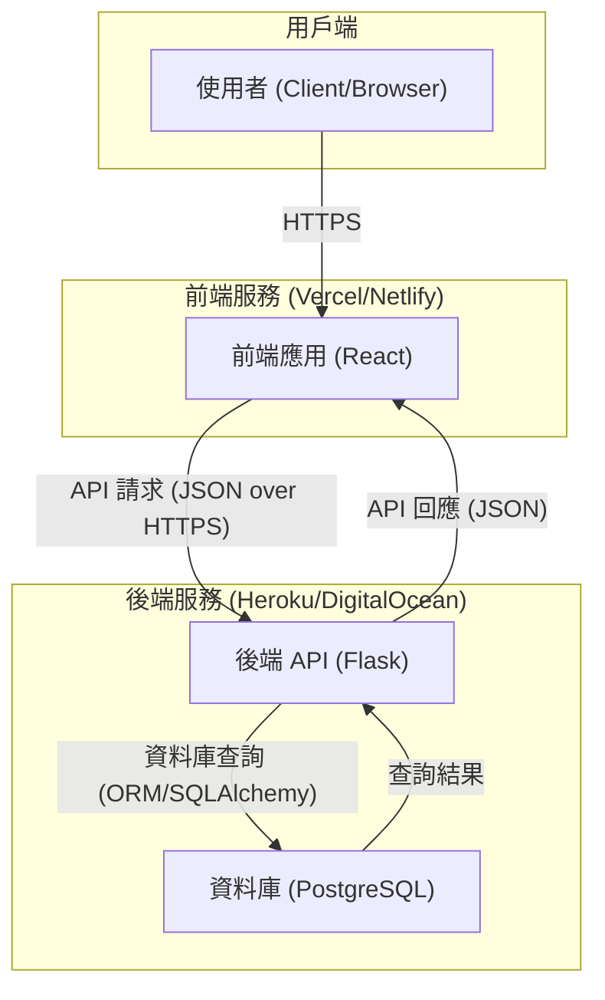

### 文件元數據 (Document Metadata)
- **文件標題**: `高階設計文檔 (High-Level Design)`
- **文件版本**: `v1.0.0`
- **作者**: `Gemini (軟體架構師)`

---

### 2. 架構總覽 (Architecture Overview)

- **核心架構**: 我們將採用「**前後端分離 (Headless)**」架構。後端作為一個獨立的服務，僅透過 API 提供數據與業務邏輯；前端則是一個完全獨立的單頁應用程式 (SPA)，負責所有使用者介面的渲染與互動。

- **設計原則**: 選擇此架構主要基於以下三個優點：
  1.  **獨立開發與部署**: 前後端團隊可以使用各自偏好的工具鏈，並行開發、獨立測試與部署，大幅提升開發效率與靈活性。
  2.  **技術棧靈活性**: 未來若要支援原生行動應用 (iOS/Android)，無需重寫後端業務邏輯。後端 API 可作為統一的數據來源，服務於多個不同的用戶端 (Web, Mobile)，符合專案長期擴展性。
  3.  **清晰的關注點分離**: 後端專注於核心業務邏輯、數據庫互動與安全性；前端專注於使用者體驗與介面呈現。這種分離使得程式碼庫更乾淨、更易於維護與理解。

- **溝通方式**: 前後端將嚴格透過 **RESTful API** 進行通訊，並以 **JSON** 作為標準的數據交換格式。

---

### 3. 技術選型與理由 (Technology Stack & Justification)

| 技術領域 | 選擇 | 選擇理由 (WHY) |
| :--- | :--- | :--- |
| **Web 框架** | **Flask** | 輕量、靈活、無過多內建假設，非常適合從 MVP 快速啟動。其豐富的擴充套件生態與模組化能力 (Blueprints) 能完全滿足專案從初期到成熟期的擴展需求。 |
| **資料庫** | **PostgreSQL** (生產環境)<br>**SQLite** (開發環境) | PostgreSQL 是功能強大、穩定可靠的開源關聯式資料庫，足以應對未來的數據增長。在開發時使用 SQLite 則能免去開發者繁瑣的資料庫設定，實現開箱即用。 |
| **ORM** | **SQLAlchemy** | Python 世界中功能最完整的 ORM，能將複雜的 SQL 操作抽象化為 Python 物件，提升開發效率並降低 SQL 注入風險。透過 `Flask-SQLAlchemy` 擴充套件能與 Flask 完美整合。 |
| **資料驗證** | **Pydantic** | 利用 Python 的類型提示 (Type Hints) 進行嚴格的 API 請求/回應數據驗證、解析與文檔生成。能確保進入業務邏輯層的數據永遠是乾淨、有效的，大幅提升系統的穩健性。 |

---

### 4. 後端專案結構 (Backend Project Structure)

我們將採用 **Flask Blueprints** 來進行模組化設計。其核心目的是「**關注點分離 (Separation of Concerns)**」，將應用程式拆分為一系列功能獨立的模組（例如：`auth`, `habits`）。每個 Blueprint 擁有自己的路由、模板和靜態文件，使專案在功能增加時，依然能保持高度的組織性與可維護性。

```
/backend
├── run.py                # 應用程式啟動入口
├── config.py             # 環境變數與設定檔
├── requirements.txt      # 專案依賴
└── app/
    ├── __init__.py       # 應用程式工廠 (Application Factory)，用於建立與設定 Flask App
    ├── models.py         # SQLAlchemy 資料庫模型 (e.g., User, Habit, Mood)
    ├── extensions.py     # Flask 擴充套件實例 (e.g., db, migrate, ma)
    └── blueprints/         # --- 存放各功能模組 (Blueprints) ---
        ├── auth/
        │   ├── __init__.py
        │   └── routes.py   # 處理註冊、登入等認證路由
        ├── habits/
        │   ├── __init__.py
        │   └── routes.py   # 處理習慣的 CRUD 路由
        └── moods/
            ├── __init__.py
            └── routes.py   # 處理心情的 CRUD 路由
```

---

### 5. 高階架構圖 (High-Level Architecture Diagram)


