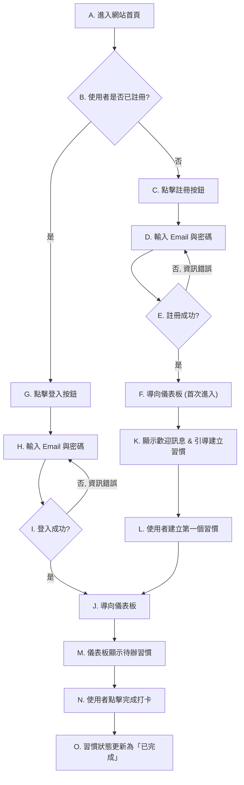

- **版本**: 1.0
- **作者**: Gemini (產品經理)

---

# 核心使用者故事 (Core User Stories)

以下是根據專案章程 MVP 範圍，專注於新使用者「關鍵路徑」的 5 個最核心使用者故事。

### 1. 新使用者註冊

* **使用者故事**: As a 追求個人成長的新使用者, I want to 透過 Email 快速建立一個新帳號, so that 我可以開始記錄我的習慣與心情。
* **驗收標準 (Acceptance Criteria)**:
  1. `Given` 我是一個未註冊的訪客，且位於註冊頁面, `When` 我輸入一個有效的 Email 和安全的密碼，並點擊「註冊」按鈕, `Then` 系統應該為我建立一個新帳號，並將我導向儀表板。
  2. `Given` 我是一個未註冊的訪客，且位於註冊頁面, `When` 我輸入一個已經被註冊過的 Email, `Then` 系統應該提示我「此 Email 已被註冊」，並引導我前往登入頁面。
  3. `Given` 我是一個未註冊的訪客，且位於註冊頁面, `When` 我輸入的密碼少於 8 個字元, `Then` 系統應該提示我「密碼長度不足」，且註冊按鈕無法點擊。

### 2. 首次引導與習慣建立

* **使用者故事**: As a 首次登入的使用者, I want to 被引導建立我的第一個想追蹤的習慣, so that 我可以立即開始使用產品的核心功能。
* **驗收標準 (Acceptance Criteria)**:
  1. `Given` 我是首次登入的使用者，且儀表板上沒有任何習慣, `When` 我進入儀表板頁面, `Then` 系統應該顯示一個歡迎訊息和一個顯眼的「建立你的第一個習慣」按鈕。
  2. `Given` 我點擊了「建立你的第一個習慣」按鈕, `When` 我在輸入框中輸入「每日運動」，並點擊「儲存」, `Then` 我的儀表板上應該出現一個名為「每日運動」的習慣卡片。
  3. `Given` 我正在建立一個新習慣, `When` 我沒有輸入任何文字就點擊「儲存」, `Then` 系統應該提示我「習慣名稱不能為空」。

### 3. 每日習慣打卡

* **使用者故事**: As a 每日返回的使用者, I want to 在儀表板上一眼看到我今天要追蹤的習慣，並能一鍵完成打卡, so that 我可以輕鬆地維持紀錄，獲得成就感。
* **驗收標準 (Acceptance Criteria)**:
  1. `Given` 我已經建立了一個名為「每日運動」的習慣，且今天尚未打卡, `When` 我登入並查看儀表板, `Then` 我應該看到一個處於「待完成」狀態的「每日運動」習慣卡片。
  2. `Given` 我在儀表板上看到「每日運動」的習慣卡片, `When` 我點擊卡片上的「完成」按鈕, `Then` 卡片的狀態應該變為「已完成」，並顯示一個正向的視覺回饋（例如：打勾動畫）。
  3. `Given` 我今天已經完成了「每日運動」的打卡, `When` 我重新整理或再次登入儀表板, `Then` 我看到的「每日運動」習慣卡片仍然應該是「已完成」狀態。

### 4. 每日心情記錄

* **使用者故事**: As a 希望自我覺察的使用者, I want to 快速記錄我今天的心情, so that 未來可以回顧我的情緒變化，並探索它與我行為之間的關聯。
* **驗收標準 (Acceptance Criteria)**:
  1. `Given` 我已經登入系統, `When` 我在儀表板上點擊「記錄今日心情」的按鈕, `Then` 系統應該彈出一個包含 5 個心情等級選項的介面。
  2. `Given` 我打開了心情記錄介面, `When` 我選擇了「開心」的表情，並點擊「儲存」, `Then` 介面應該關閉，並提示我「心情已記錄」。
  3. `Given` 我今天已經記錄過心情, `When` 我再次點擊「記錄今日心情」的按鈕, `Then` 系統應該顯示我今天已記錄的心情，並提供「編輯」選項。

### 5. 查看初步洞察

* **使用者故事**: As a 已經使用一週的使用者, I want to 在儀表板上看到我的習慣連續紀錄與心情趨勢圖, so that 我可以獲得初步的洞察，激勵我持續下去。
* **驗收標準 (Acceptance Criteria)**:
  1. `Given` 我已經連續 7 天完成了「每日運動」的打卡, `When` 我查看儀表板, `Then` 我應該看到一個顯示「連續 7 天」的連擊 (Streak) 紀錄。
  2. `Given` 我在過去 7 天每天都記錄了心情, `When` 我查看儀表板, `Then` 我應該看到一條顯示過去 7 天心情分數變化的趨勢線圖。
  3. `Given` 我在儀表板上, `When` 我從下拉選單中選擇「每日運動」, `Then` 圖表上應該同時疊加顯示「每日運動」的打卡紀錄和心情趨勢線。

---

# 使用者流程圖 (User Flow Diagram)

以下流程圖聚焦於「**新使用者從進入網站到完成第一次習慣打卡**」的關鍵路徑。

## 流程圖詳細說明

1. **A/B. 進入網站與分流**: 這是使用者旅程的起點。系統需要立即判斷使用者是新訪客還是回訪客，並提供最直接的路徑。**WHY**: 為了減少新舊使用者的混淆，讓新使用者能快速找到註冊入口，回訪客能無礙地登入，避免不必要的點擊和挫折感。
2. **C/D/E. 註冊流程**: 這是獲取新使用者的關鍵步驟。流程設計得盡可能簡潔，只要求最必要的資訊（Email/密碼）。**WHY**: 根據專案章程，目標使用者生活忙碌，需要「簡單、無壓力」的工具。過於繁瑣的註冊流程會造成使用者在體驗核心價值前就流失。
3. **F/K/L. 首次登入與引導 (Onboarding)**: 這是創造使用者「Aha! Moment」的起點。與其給使用者一個空白、不知所措的儀表板，不如主動引導他們建立第一個習慣。**WHY**: 這是為了讓使用者立即感受到產品的用途，並完成一個有意義的操作。此步驟直接對應專案章程中的「使用者流失風險」，透過即時的價值回饋來降低此風險。
4. **J/M. 儀表板與待辦事項**: 儀表板是使用者的「指揮中心」。將待辦習慣清晰地展示出來是核心功能。**WHY**: 使用者需要一個清晰的視覺提示來提醒自己今天的任務，這是觸發「習慣打卡」這個核心循環行為的關鍵。設計必須一目了然。
5. **N/O. 完成打ка 與即時回饋**: 這是產品核心循環的閉環。使用者完成動作後，必須給予立即、正向的視覺回饋。**WHY**: 根據專案章程，使用者難以堅持是因為「缺乏持續的正向反饋」。這個即時回饋機制正是為了解決此痛點，透過微小的成就感來增強使用者持續使用的動機。
